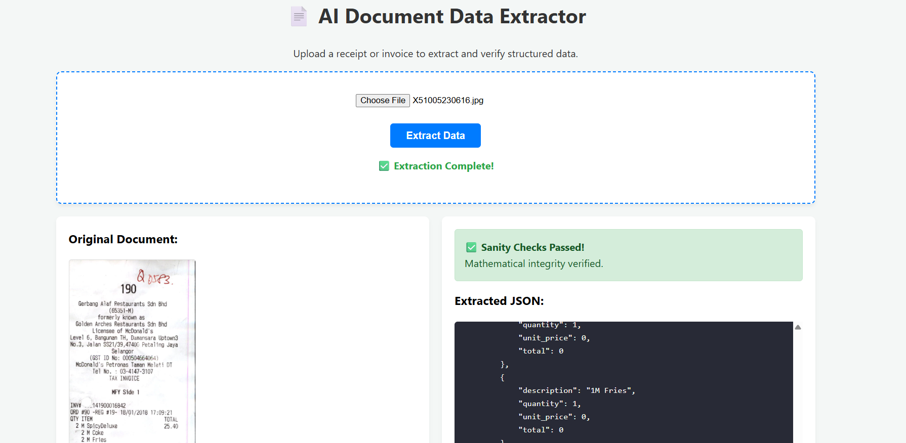
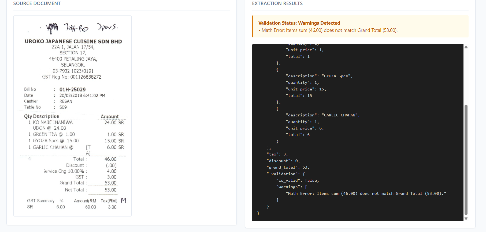

# Document Data Extractor

A web application that extracts structured JSON data from receipt and invoice images or PDFs, featuring automated mathematical validation.

---

## Overview

This application processes receipt and invoice documents using OCR and an LLM to extract itemized descriptions, unit prices, line totals, taxes, and grand totals. Extracted values are passed through a deterministic Python validation module to check mathematical consistency before returning the final JSON.

---

## Tech Stack

* **Frontend:** Vanilla HTML, CSS, JavaScript (Local web UI)
* **Backend:** FastAPI, Uvicorn
* **OCR Engine:** Tesseract OCR, OpenCV
* **Parsing Engine:** Groq API (`llama-3.3-70b-versatile`)

---

## Setup and Installation

### Option A: Docker (recommended)

This avoids every OS-specific setup issue below entirely — Tesseract install
differences, Python environment conflicts, PATH problems. All you need is
Docker installed.

```bash
git clone https://github.com/mohammedibrahim5002/document_data_extractor
cd document_data_extractor

docker build -t doc-extractor .
docker run -p 8000:8000 --env-file .env doc-extractor
```

Before running, create a `.env` file in the project root (see **Configuring your `.env` file** below — don't skip this, a wrong text encoding here is the single most common setup failure).

Open `http://localhost:8000`.

### Option B: Local Python environment

Unlike Option A, this depends on your local Python/Tesseract setup being clean.

#### Prerequisites

Tesseract OCR must be installed on your system:

* **Windows:** Download and run the installer from the official Tesseract repository.
* **macOS:** `brew install tesseract`
* **Linux:** `sudo apt install tesseract-ocr`

#### Installation Steps

1. Clone the repository:
   ```bash
   git clone https://github.com/mohammedibrahim5002/document_data_extractor
   cd document_data_extractor
   ```

2. Create a virtual environment:
   ```bash
   python -m venv venv
   ```

   Activate it — **use the command matching your shell**:
   * Command Prompt (Windows): `venv\Scripts\activate.bat`
   * PowerShell (Windows): `.\venv\Scripts\Activate.ps1` — if this errors about
     script execution being disabled, run
     `Set-ExecutionPolicy -Scope CurrentUser RemoteSigned` once, then retry.
   * macOS/Linux: `source venv/bin/activate`

   Your prompt should now show `(venv)`. If you also have Anaconda/Miniconda
   installed, run `conda deactivate` first if your prompt shows `(base)` —
   installing into a conda base environment is a common source of Windows
   permission errors with this project's dependencies.

3. Install required dependencies:
   ```bash
   pip install -r requirements.txt
   ```

4. Create your `.env` file — see **Configuring your `.env` file** below.

## Configuring your `.env` file

Create a file named exactly `.env` in the project root, containing one line:

```env
GROQ_API_KEY=your_groq_api_key_here
```

Get a free key at [console.groq.com](https://console.groq.com).

**How you create this file matters more than it looks.** The most reliable way
on any OS is a plain text editor (VS Code, Notepad, nano) — type the line and
save. Explicitly avoid these two, which silently produce a broken file:

* **PowerShell:** `echo "..." > .env` writes **UTF-16 with a BOM** by default,
  not UTF-8. This project reads `.env` expecting UTF-8, so a UTF-16 file causes
  the API key to be read incorrectly — showing up as either an "invalid API
  key" error from Groq, or a UTF-8/UTF-16 decode error, even though the file
  looks correct when you open it. If you must use a one-line terminal command
  in PowerShell, use this instead:
  ```powershell
  Set-Content -Path .env -Value "GROQ_API_KEY=your_key_here" -Encoding utf8NoBOM
  ```
* **Windows Notepad "Save As":** make sure the encoding dropdown at the bottom
  of the save dialog says **UTF-8**, not "UTF-16 LE" (Notepad's older default
  on some Windows versions).

If you already created `.env` and are seeing key or encoding errors, the
fastest fix is to delete it and recreate it with one of the safe methods above.

## Usage

1. Start the FastAPI server:
   ```bash
   python app.py
   ```

2. Open the web interface in your browser (default: `http://localhost:8000`).
3. Upload a receipt or invoice (JPEG, PNG, or PDF).
4. View the original document preview and extracted JSON output side-by-side.

Processed output files are stored in the `outputs/` directory.

---

## Demo

**A clean extraction, sanity checks passed:**



**A real validation warning catching a known limitation in practice** — this
receipt has a 10% service charge (4.00) and GST (3.00) that aren't reflected
in the line items, so the item sum (46.00) legitimately doesn't match the
grand total (53.00). Rather than silently accepting it, the validation layer
flags the discrepancy for review — this is the "Unaccounted Fees" limitation
described below, actually happening:



---

## Validation Logic

Extracted numerical values undergo programmatic verification in Python:

$$\text{Calculated Total} = \sum \text{Line Item Totals} + \text{Tax} - \text{Discount}$$

* The module compares the calculated total against the extracted grand total within a $0.05 tolerance.
* Verification supports both tax-inclusive and tax-exclusive document layouts.
* If a discrepancy is found, the `_validation` block in the JSON output marks `is_valid: false` and lists the specific warning.

---

## Troubleshooting

Every issue below was actually hit and fixed while testing this setup — not
hypothetical.

**`Access is denied: '...\site-packages\cv2\cv2.pyd'` during `pip install`**
You're installing into a shared/system Python (often Anaconda's `base`
environment under `C:\miniconda3\...`), which Windows protects. Make sure a
project-specific virtual environment is actually active — your terminal
prompt should show `(venv)`. If it shows `(base)` instead, run `conda
deactivate` first, then activate `venv` as described above.

**`(venv)` never appears after running the activate command (no error either)**
In PowerShell, `venv\Scripts\activate` (the `.bat` version) does nothing —
you need `.\venv\Scripts\Activate.ps1`. If *that* errors about script
execution being disabled, run once:
```powershell
Set-ExecutionPolicy -Scope CurrentUser RemoteSigned
```
then retry activation.

**`Cannot uninstall numpy ... no RECORD file was found`**
pip is trying to manage a numpy install it didn't create (usually one from
conda). This means you're still not inside a clean virtual environment.
Delete and recreate it:
```bash
deactivate
rm -rf venv          # Windows: rmdir /s /q venv
python -m venv venv
```
then activate and `pip install -r requirements.txt` again.

**A pinned package version fails to install on a specific machine**
`requirements.txt` pins most versions exactly for reproducibility, but
`numpy` is intentionally left as a range (`numpy>=1.26,<3.0`) rather than an
exact pin, because an exact numpy version doesn't always have a prebuilt
wheel for every Python version/OS/CPU combination. If another dependency
ever hits this same problem on your machine, the fix is the same: loosen
that one line to a range instead of an exact version.

**API key errors, or a UTF-8/UTF-16 decode error on startup**
See **Configuring your `.env` file** above — this is almost always a text
encoding problem with how `.env` was created, not an actually-invalid key.

**Docker Desktop: "Virtualization support not detected"**
Virtualization (Intel VT-x / AMD-V) is disabled in your PC's BIOS/UEFI
firmware. Restart, enter BIOS setup (commonly F2, F10, Del, or Esc on the
first boot screen — varies by manufacturer), enable **Intel Virtualization
Technology** / **SVM Mode** / **Virtualization Technology** under
Advanced/CPU/Security settings, save and exit. If Docker still won't start
afterward, also run as Administrator in PowerShell:
```powershell
dism.exe /online /enable-feature /featurename:Microsoft-Windows-Subsystem-Linux /all /norestart
dism.exe /online /enable-feature /featurename:VirtualMachinePlatform /all /norestart
```
then restart once more. On a locked-down/managed machine, BIOS access may
not be available — in that case use Option B (local Python environment)
instead of Docker.

---

## Known Limitations

* **Unaccounted Fees:** The current schema targets line items, taxes, and discounts. Receipts containing service charges or rounding adjustments will trigger a validation warning for manual review.
* **Unpriced Sub-items:** Combo options or sub-items printed without explicit individual prices are assigned a value of `0.0`.
* **OCR Quality:** Highly degraded or blurry scans may result in misread characters, triggering validation checks.